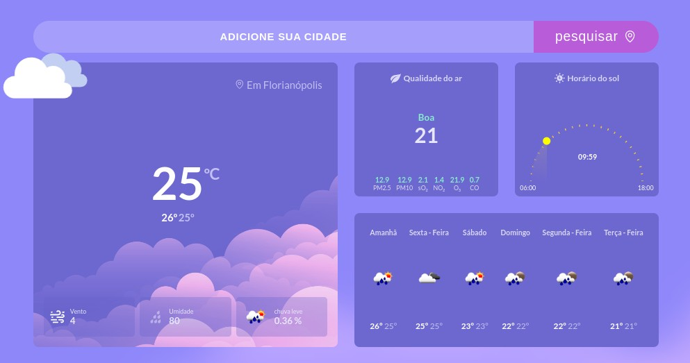

<h1 align="center"> Amanhã vai chover? </h1>

  O aplicativo "Amanhã vai chover" é uma aplicação de previsão do tempo que permite aos usuários obter atualizações em tempo real sobre as condições meteorológicas de uma determinada cidade. Ao fornecer o nome de uma cidade, o aplicativo exibe a temperatura atual, as condições meteorológicas e uma previsão de cinco dias. O aplicativo é construído usando HTML, CSS e JavaScript, e usa a API OpenWeatherMap para buscar dados meteorológicos...

  <a href="#-tecnologias">Technologies</a>&nbsp;&nbsp;&nbsp;|&nbsp;&nbsp;&nbsp;
  <a href="#-projeto">Project</a>&nbsp;&nbsp;&nbsp;|&nbsp;&nbsp;&nbsp;
  <a href="#-layout">Layout</a>&nbsp;&nbsp;&nbsp;|&nbsp;&nbsp;&nbsp;
  <a href="#memo-licença">License</a>

  

  

## 🚀 Tecnologias

Este projeto foi desenvolvido com as seguintes tecnologias:

- HTML e CSS - JavaScript
- OpenWeather API

## 💻 Projeto

Esta é uma página de previsão do tempo que fornece informações precisas sobre as condições meteorológicas em tempo real.

## 🔖 Layout

Para testar o projeto você pode acessar através [ESTE LINK]()

## :memo: Licença

This project is under the MIT license.

---

Feito com ♥ por RafaGnx
